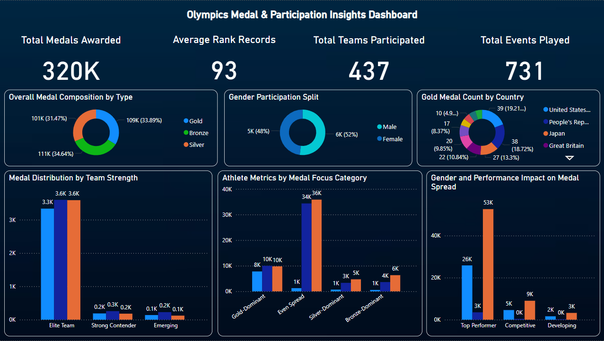
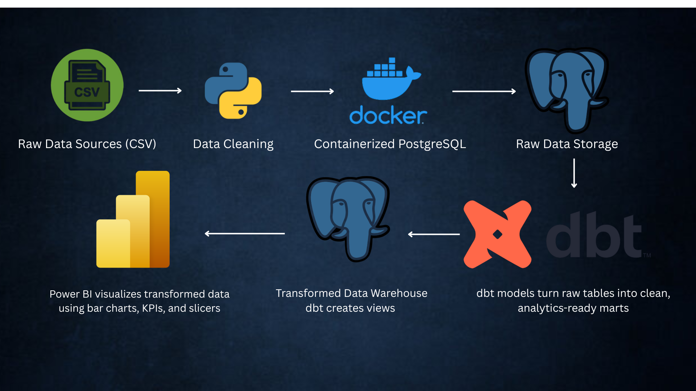

# 🏅 Olympics Data Engineering & BI Pipeline

An end-to-end data engineering pipeline that takes Tokyo Olympics datasets from raw CSVs → PostgreSQL → dbt models → Power BI dashboard, fully containerized with Docker.

---

## 📸 Project Screenshots

### 📊 Final Dashboard


### 🔷 Pipeline Architecture


---

## 📁 Table of Contents

- [Tech Stack](#-tech-stack)
- [Folder Structure](#-folder-structure)
- [Setup Instructions](#-setup-instructions)
- [Transformed Tables](#-transformed-tables)
- [Dashboard KPIs](#-dashboard-kpis)
- [Pipeline Output Summary](#-pipeline-output-summary)
- [Contributors](#-contributors)

---

## 🧱 Tech Stack

| Layer             | Tool                |
|------------------|---------------------|
| 🗂 Data Source     | CSV (Excel Format)  |
| 🐍 Ingestion       | Python + pandas     |
| 🐘 Storage         | PostgreSQL (Docker) |
| 🦊 Transformation  | dbt (PostgreSQL)    |
| 📊 BI & Insights   | Power BI            |

---

## 🛠 Folder Structure

```

olympics-data-pipeline/
├── data/                      # Raw CSVs
├── postgres/                  # Docker init scripts
├── olympics\_dbt/              # dbt project
│   └── models/
│       ├── staging/
│       └── marts/
├── dashboard/
│   └── Dashboard.png
├── Pipeline.png
├── ingestion/
│   └── load\_to\_postgres.py
├── docker-compose.yml
└── .env

---

## 🚀 Setup Instructions

```bash
# 1. Start PostgreSQL container
docker-compose up -d

# 2. Ingest data into PostgreSQL
python ingestion/load_to_postgres.py

# 3. Run dbt transformations
cd olympics_dbt
dbt run
````

Open `dashboard/olympics_dashboard.pbix` in Power BI and refresh the data.

---

## 📚 Transformed Tables

| Table Name                 | Description                                                                                         |
| -------------------------- | --------------------------------------------------------------------------------------------------- |
| `stg_athletes`             | Standardizes athlete names, NOC, and disciplines. Adds `athlete_row_num` for partitioned ranking.   |
| `stg_medals`               | Casts medal counts into integers and calculates `rank_by_gold` using a window function.             |
| `stg_entries_gender`       | Transforms gender participation entries per discipline, adds `participation_rank`.                  |
| `stg_teams`                | Extracts and ranks team entries per discipline with `team_rank_within_discipline`.                  |
| `discipline_medal_summary` | Aggregates medals by discipline and NOC, includes `athlete_count`, `medal_focus`, and rank metrics. |
| `gender_medal_ratio`       | Links gender participation to medal outcomes; classifies `gender_dominance` and `performance_tier`. |
| `noc_medal_trends`         | Ranks NOCs by gold and total medals; classifies `performance_band`.                                 |
| `team_discipline_strength` | Summarizes team participation vs medals per discipline; categorizes `team_medal_strength`.          |

---

## 📊 Dashboard KPIs

* 🏅 Total medals by NOC, team strength, and discipline
* 👤 Gender dominance and medal output per entry
* 📈 Performance band classification: Top Performer, Competitive, Developing
* 🧠 Medal focus categories: Gold-Dominant, Silver-Dominant, Even Spread

---

## 📦 Pipeline Output Summary

| Stage            | Output Description                                 |
| ---------------- | -------------------------------------------------- |
| Raw → PostgreSQL | Cleaned and ingested data tables                   |
| PostgreSQL → dbt | Transformed marts with rankings, aggregations      |
| dbt → Power BI   | Interactive visuals powered by curated tables      |
| Full Pipeline    | Daily-refreshable insights via containerized setup |

---

## 👨‍💻 Contributors

* **Mujtaba Saqib** – Data Engineering, Transformation Modeling, Power BI

---

## 📄 License

MIT License – free to use, fork, and adapt for educational and professional use.
